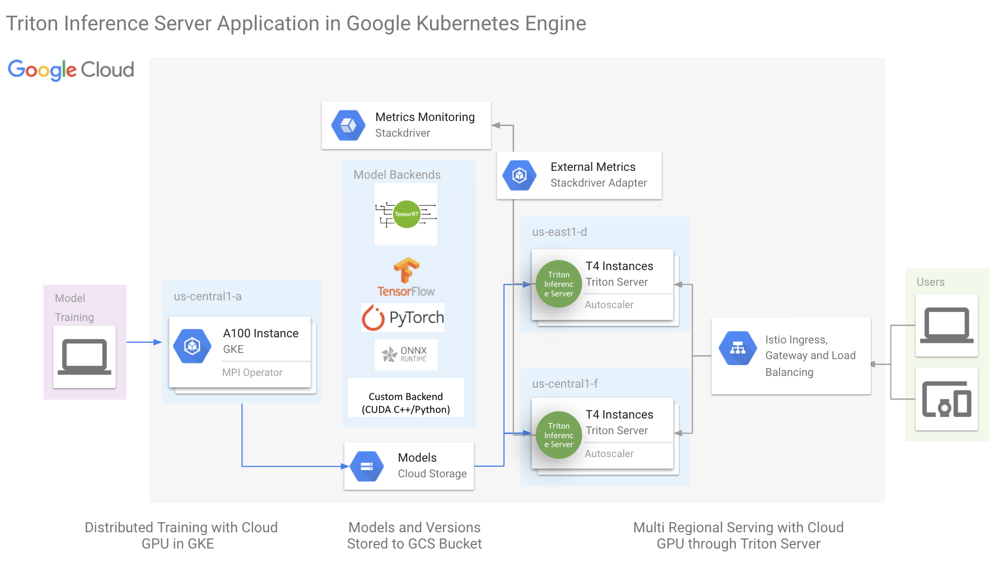
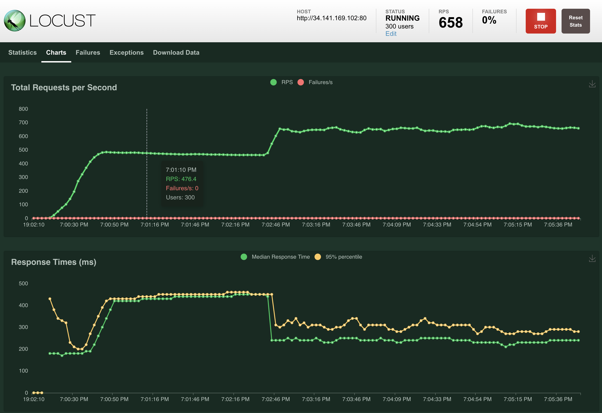

<!--
# Copyright (c) 2021, NVIDIA CORPORATION & AFFILIATES. All rights reserved.
#
# Redistribution and use in source and binary forms, with or without
# modification, are permitted provided that the following conditions
# are met:
#  * Redistributions of source code must retain the above copyright
#    notice, this list of conditions and the following disclaimer.
#  * Redistributions in binary form must reproduce the above copyright
#    notice, this list of conditions and the following disclaimer in the
#    documentation and/or other materials provided with the distribution.
#  * Neither the name of NVIDIA CORPORATION & AFFILIATES nor the names of its
#    contributors may be used to endorse or promote products derived
#    from this software without specific prior written permission.
#
# THIS SOFTWARE IS PROVIDED BY THE COPYRIGHT HOLDERS ``AS IS'' AND ANY
# EXPRESS OR IMPLIED WARRANTIES, INCLUDING, BUT NOT LIMITED TO, THE
# IMPLIED WARRANTIES OF MERCHANTABILITY AND FITNESS FOR A PARTICULAR
# PURPOSE ARE DISCLAIMED.  IN NO EVENT SHALL THE COPYRIGHT OWNER OR
# CONTRIBUTORS BE LIABLE FOR ANY DIRECT, INDIRECT, INCIDENTAL, SPECIAL,
# EXEMPLARY, OR CONSEQUENTIAL DAMAGES (INCLUDING, BUT NOT LIMITED TO,
# PROCUREMENT OF SUBSTITUTE GOODS OR SERVICES; LOSS OF USE, DATA, OR
# PROFITS; OR BUSINESS INTERRUPTION) HOWEVER CAUSED AND ON ANY THEORY
# OF LIABILITY, WHETHER IN CONTRACT, STRICT LIABILITY, OR TORT
# (INCLUDING NEGLIGENCE OR OTHERWISE) ARISING IN ANY WAY OUT OF THE USE
# OF THIS SOFTWARE, EVEN IF ADVISED OF THE POSSIBILITY OF SUCH DAMAGE.
-->

# NVIDIA Triton Inference Server GKE Marketplace Application

**Table Of Contents**
- [Description](#description)
- [Prerequisites](#prerequisites)
- [Demo Instruction](#demo-instruction)
- [Additional Resources](#additional-resources)
- [Known Issues](#known-issues)

## Description

This repository contains Google Kubernetes Engine(GKE) Marketplace Application for NVIDIA Triton Inference Server deployer. 

 - Triton GKE deployer is a helm chart deployer recommended by GKE Marketplace
 - Triton GKE deployer leverage [Istio on GCP](https://cloud.google.com/istio/docs/istio-on-gke/overview) for traffic ingress and load balancing, user can further config Istio for advanced use cases in service mesh and Anthos
 - Triton GKE deployer includes a horizontal pod autoscaler(HPA) which relies on [stack driver custom metrics adaptor](https://github.com/GoogleCloudPlatform/k8s-stackdriver/tree/master/custom-metrics-stackdriver-adapter) to monitor GPU duty cycle, and auto scale GPU nodes.
 - This repo also contains a sample to generate BERT model with TensorRT and use Locust to experiment with GPU node autoscaling and monitor client latency/throughput. 



## Prerequisites

 - [Install Google Cloud SDK on your laptop/client workstation](https://cloud.google.com/sdk/docs/install), so that `gcloud` SDK cli interface could be run on the client and sign in with your GCP credentials. 
 - In addition, user could leverage [Google Cloud shell](https://cloud.google.com/shell/docs/launching-cloud-shell).

## Demo Instruction

First, install this Triton GKE app to an existing GKE cluster with GPU node pool, Google Cloud Marketplace currently doesn't support auto creation of GPU clusters. User has to run following command to create a compatible cluster (gke version >=1.18.7) with GPU node pools, we recommend user to select T4 or A100(MIG) instances type and choose CPU ratio based on profiling of actual inference workflow. 

Currently, GKE >= 1.18.7 only supported in GKE rapid channel, to find the latest version, please visit [GKE release notes](https://cloud.google.com/kubernetes-engine/docs/release-notes).
```
export PROJECT_ID=<your GCP project ID>
export ZONE=<GCP zone of your choice>
export REGION=<GCP region of your choice>
export DEPLOYMENT_NAME=<GKE cluster name, triton_gke for example>

gcloud beta container clusters create ${DEPLOYMENT_NAME} \
--addons=HorizontalPodAutoscaling,HttpLoadBalancing,Istio \
--machine-type=n1-standard-8 \
--node-locations=${ZONE} \
--subnetwork=default \
--scopes cloud-platform \
--num-nodes 1

# add GPU node pools, user can modify number of node based on workloads
gcloud container node-pools create accel \
  --project ${PROJECT_ID} \
  --zone ${ZONE} \
  --cluster ${DEPLOYMENT_NAME} \
  --num-nodes 2 \
  --accelerator type=nvidia-tesla-t4,count=1 \
  --enable-autoscaling --min-nodes 2 --max-nodes 3 \
  --machine-type n1-standard-4 \
  --disk-size=100 \
  --scopes cloud-platform \
  --verbosity error

# so that you can run kubectl locally to the cluster
gcloud container clusters get-credentials ${DEPLOYMENT_NAME} --project ${PROJECT_ID} --zone ${ZONE}  

# deploy NVIDIA device plugin for GKE to prepare GPU nodes for driver install
kubectl apply -f https://raw.githubusercontent.com/GoogleCloudPlatform/container-engine-accelerators/master/nvidia-driver-installer/cos/daemonset-preloaded.yaml

# make sure you can run kubectl locally to access the cluster
kubectl create clusterrolebinding cluster-admin-binding --clusterrole cluster-admin --user "$(gcloud config get-value account)"

# enable stackdriver custom metrics adaptor
kubectl apply -f https://raw.githubusercontent.com/GoogleCloudPlatform/k8s-stackdriver/master/custom-metrics-stackdriver-adapter/deploy/production/adapter.yaml
```

GPU resources in GCP could be fully utilized, so please try a different zone in case compute resource cannot be allocated. After GKE cluster is running, run `kubectl get pods --all-namespaces` to make sure the client can access the cluster correctly: 

If user would like to experiment with A100 MIG partitioned GPU in GKE, please create node pool with following command:
```
gcloud beta container node-pools create accel \
  --project ${PROJECT_ID} \
  --zone ${ZONE} \
  --cluster ${DEPLOYMENT_NAME} \
  --num-nodes 1 \
  --accelerator type=nvidia-tesla-a100,count=1,gpu-partition-size=1g.5gb  \
  --enable-autoscaling --min-nodes 1 --max-nodes 2 \
  --machine-type=a2-highgpu-1g  \
  --disk-size=100 \
  --scopes cloud-platform \
  --verbosity error

# deploy a newer NVIDIA device plugin for GKE to prepare GPU nodes for driver install, additional line to install MIG
kubectl apply -f https://raw.githubusercontent.com/GoogleCloudPlatform/container-engine-accelerators/master/cmd/nvidia_gpu/device-plugin.yaml
kubectl apply -f https://raw.githubusercontent.com/GoogleCloudPlatform/container-engine-accelerators/master/nvidia-driver-installer/cos/daemonset-nvidia-mig.yaml
```

Please note that A100 MIG in GKE does not support GPU metrics yet, also Triton GPU Metrics is not compatiable with A100 MIG. Hence, please disable GPU metrics by unselect allowGPUMetrics while deploy Triton GKE app. Also for the same reason, this deployer doesn't support inference workfload auto-scaling on A100 MIG as well.  

Second, go to [GKE Marketplace link](https://console.cloud.google.com/marketplace/details/nvidia-ngc-public/triton-inference-server) to deploy Triton application. User could leave everything as default, if user has model that has been validated with Triton, they can provide GCS path point to that model in Triton format. By default, we provide a BERT large model optimized by TensorRT with batch size of 1 in public GCS bucket that is compatible with 21.06 release of Triton Server, in `gs://triton_sample_models/21_06`, please note this TensorRT engine only work with Tesla T4. If experiment with A100 MIG 5gb partition, user could use `gs://triton_sample_models/21_06_mig5g`. Also please note that this bucket locates in us-central1 hence loading model into Triton in other region might be effected. Also the first deployment of Triton Application will be slower than consecutive runs as image needs to be pulled into the GKE cluster. 


We want to discuss HPA autoscaling metrics users can leverage. GPU Power(Percentage of Power) tends to be a reliable metric, especially for larger GPU like V100 and A100. GKE currently natively support GPU duty cycle which is GPU utilization in `nvidia-smi`. We ask users always profile their model to determine the autoscaling target and metrics. When attempting to select the right metrics for autoscaling, the goal should be to pick metrics based on the following: 1, meet SLA rrequirement. 2, give consideration to transient request load, 3, keep GPU as fully utilized as possible. Profiling comes in 2 aspects: If user decided to use Duty Cycle or other GPU metric, it is recommend establish baseline to link SLA requirement such as latency with GPU metrics, for example, for model A, latency will be below 10ms 99% of time when Duty Cycle is below 80% utilized. Additionally, profiling also provide insight to model optimization for inference, with tools like [Nsight](https://developer.nvidia.com/nsight-systems).

As the application deployed successfully, get Istio Ingress host and port
```
export INGRESS_HOST=$(kubectl -n istio-system get service istio-ingressgateway -o jsonpath='{.status.loadBalancer.ingress[0].ip}')
export INGRESS_PORT=$(kubectl -n istio-system get service istio-ingressgateway -o jsonpath='{.spec.ports[?(@.name=="http2")].port}')
```

Third, we will try sending request to server with provide client example.

If User selected deploy Triton to accept HTTP request, please launch [Locust](https://docs.locust.io/en/stable/installation.html) with Ingress host and port to query Triton Inference Server. In this [example script](https://github.com/triton-inference-server/server/tree/master/deploy/gke-marketplace-app/client-sample/locustfile_bert_large.py), we send request to Triton server which has loaded a BERT large TensorRT Engine with Sequence length of 128 into GCP bucket. We simulate 300 concurrent user as target and spawn user at rate of 10 users per second.
```
locust -f locustfile_bert_large.py -H http://${INGRESS_HOST}:${INGRESS_PORT}
```

The client example push about ~300 QPS(Query per second) to Triton Server, and will trigger a auto scale of T4 GPU nodes (We recommend to use T4 and A100[MIG] for inference). From locust UI, we will observer a drop of latency mean and variance for the requests. At the end, after autoscaling, we see the latency stablized at ~60 ms, which is excellent for a model that has 345 million parameters. Since for each node, we use 1T4 + n1-standard-4 instance, and it can handle ~200 QPS, with on-demand price, it is ($0.35+$0.19)=$0.54/hr, that translate to 1.3 million inference per dollar for BERT large model at batch size 1. Further more, with 3 year commitment price, hr rate is ($0.16+$0.08)=$0.24/hr, that translate to 3 million inference per dollar. 



Alternatively, user can opt to use [Perf Analyzer](https://github.com/triton-inference-server/server/blob/master/docs/perf_analyzer.md) to profile and study the performance of Triton Inference Server. Here we also provide a [client script](https://github.com/triton-inference-server/server/tree/master/deploy/gke-marketplace-app/client-sample/perf_analyzer_grpc.sh) to use Perf Analyzer to send gRPC to Triton Server GKE deployment. Perf Analyzer client requires user to use NGC Triton Client Container(docker pull nvcr.io/nvidia/tritonserver:21.06-py3-sdk).  
```
bash perf_analyzer_grpc.sh ${INGRESS_HOST}:${INGRESS_PORT}
```

## Additional Resources

See the following resources to learn more about NVIDIA Triton Inference Server and GKE GPU capabilities.

**Documentation**

- [GPU in Google Kubernetes Engine](https://cloud.google.com/kubernetes-engine/docs/how-to/gpus)
- [Optimize GPU Performance in Google Cloud Platform](https://cloud.google.com/compute/docs/gpus/optimize-gpus)
- [Triton Inference Server](https://github.com/triton-inference-server/server)
- [AI Platform Prediction: Custom container concepts with Triton Server](https://cloud.google.com/solutions/ai-platform-prediction-custom-container-concepts) by [Kevin Tsai](https://github.com/merlin1649)
- [AI Platform Prediction: Direct model server setup for NVIDIA Triton Inference Server](https://cloud.google.com/solutions/ai-platform-prediction-direct-model-server-nvidia) by [Kevin Tsai](https://github.com/merlin1649)

## Known Issues

- When EXTERNAL-IP stuck in pending state, user can do `kubectl describe svc istio-ingressgateway -n istio-system` to understand and cause, then proceed to increase quota for `Forwarding Rules` as `compute.googleapis.com/forwarding_rules`, `TARGET_POOLS` as `compute.googleapis.com/target_pools` or `HEALTH_CHECKS` as `compute.googleapis.com/health_checks`
- GKE one click cluster creation doesn't support GPU node pools at the moment, users have to mannually create a compatible (>=1.18.7) cluster and attach node pool (T4 and A100 MIG recommended)
- When Horizontal Pod Autoscaler(HPA) expand and all GPU node pool already utilized, GKE will request new GPU node and it can take between 4-7 minutes, it could be a long wait plus GPU driver install and image pulling. We recommend user to leverage multi-tier model serving and Triton's priority feature to create cushion for latency critical models, and allocate active standby GPU node for spike of requests.
